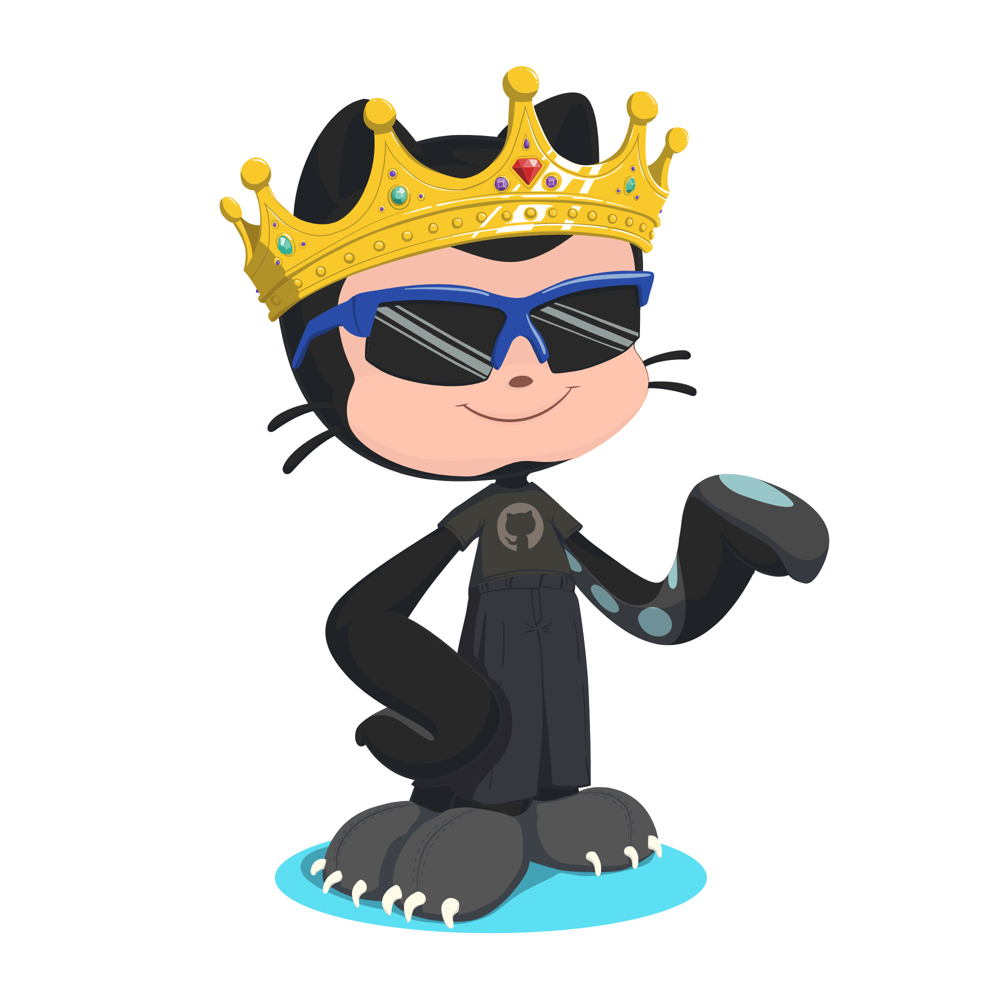

```javascript
const Radya = {
  pronouns: "He" | "Him",
  lang: ["HTML", "CSS", "JavaScript", "Typescript", "Golang"],
  interest: ["Web Developer", "Game", "Tech", "IoT"],
  technologies: {
    frontEnd: {
      js: ["ReactJS", "VueJs", "Nuxtjs", "NextJs"]
    },
    backEnd: {
      js: ["NodeJS", "ExpressJS", "Fastify"],
      Golang: ["Gin","Echo"]
    },
    databases: {
      sql: ["MySQL", "Supabase"],
      noSql: ["firebase"],
    },
  },
};
```



 <br> <br> <br> <br>

